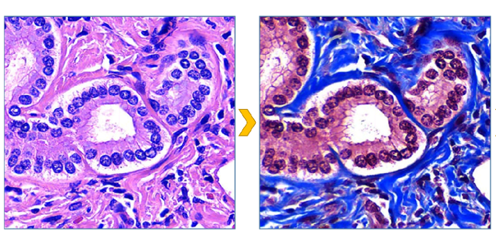

HE2MT: GANs based digital trichrome stained histology 
----------------------------------------------------------------------------------------------------------------------
Conditional GANs based system for fibrosis detection and quantification in Hematoxylin and Eosin whole slide images. 
*Medical Image Analysis*

Manuscript: https://www.sciencedirect.com/science/article/pii/S1361841522001840 \\
Interactive Demo: \\
Cite: Naglah, A., Khalifa, F., El-Baz, A. and Gondim, D., 2022. Conditional GANs based system for fibrosis detection and quantification in Hematoxylin and Eosin whole slide images. Medical Image Analysis, 81, p.102537.


## Abstract

Assessing the degree of liver fibrosis is fundamental for the management of patients with chronic liver disease, in 
liver transplants procedures, and in general liver disease research. The fibrosis stage is best assessed by histo
pathologic evaluation, and Masson’s Trichrome stain (MT) is the stain of choice for this task in many laboratories 
around the world. However, the most used stain in histopathology is Hematoxylin Eosin (HE) which is cheaper, 
has a faster turn-around time and is the primary stain routinely used for evaluation of liver specimens. In this 
paper, we propose a novel digital pathology system that accurately detects and quantifies the footprint of fibrous 
tissue in HE whole slide images (WSI). The proposed system produces virtual MT images from HE using a deep 
learning model that learns deep texture patterns associated with collagen fibers. The training pipeline is based on 
conditional generative adversarial networks (cGAN), which can achieve accurate pixel-level transformation. Our 
comprehensive training pipeline features an automatic WSI registration algorithm, which qualifies the HE/MT 
training slides for the cGAN model. Using liver specimens collected during liver transplantation procedures, we 
conducted a range of experiments to evaluate the detected footprint of selected anatomical features. Our eval
uation includes both image similarity and semantic segmentation metrics. The proposed system achieved 
enhanced results in the experiments with significant improvement over the state-of-the-art CycleGAN learning 
style, and over direct prediction of fibrosis in HE without having the virtual MT step.  


## References

Naglah, A., Khalifa, F., El-Baz, A. and Gondim, D., 2022. Conditional GANs based system for fibrosis detection and quantification in Hematoxylin and Eosin whole slide images. Medical Image Analysis, 81, p.102537.

```
@article{naglah2022conditional,
  title={Conditional GANs based system for fibrosis detection and quantification in Hematoxylin and Eosin whole slide images},
  author={Naglah, Ahmed and Khalifa, Fahmi and El-Baz, Ayman and Gondim, Dibson},
  journal={Medical Image Analysis},
  volume={81},
  pages={102537},
  year={2022},
  publisher={Elsevier}
}
```
